# MercuryDB 🧠

> **ML 솔루션 설계를 위한 지식 네트워크**  
> _"Not just organizing knowledge, but building a neural network of ML solutions"_

## 📌 What is MercuryDB?

MercuryDB는 AWS Machine Learning 솔루션 패턴을 체계화한 지식 네트워크입니다. 시작은 MLS-C01 자격증 준비였지만, 궁극적으로는 **기업의 비즈니스 컨텍스트를 분석하여 최적의 ML 솔루션을 자동으로 설계하는 AI 시스템**으로 진화하고 있습니다.

### 🎯 핵심 목표

- **단기**: MLS-C01 자격증 대비 및 ML 개념 내재화
- **중기**: 실제 적용 가능한 ML 솔루션 패턴 축적
- **장기**: CEO 인터뷰 → 자동 ML 솔루션 설계 시스템

## 🏗️ 구조

```
/MercuryDB
├── 📁 Meta/                    # 시스템 메타데이터
│   ├── 📁 graphview-history/   # 일별 성장 로그 및 스냅샷
│   │   ├── graph-view-2025-08-16.png
│   │   └── graph-view-2025-08-16.md
│   └── 📁 templates/           # 노트 템플릿 및 태그 정의
│       ├── neurons-template-v6.md    # 최신 뉴런 템플릿
│       └── tag-category-v1.md        # 태그 카테고리 정의
│
├── 📁 Neurons/                 # 모든 지식 노트 (폴더 구분 없음)
│   └── *.md                   # 각 노트는 하나의 뉴런
│
└── README.md                   # 이 문서
```

### 폴더 설명

#### 📁 Meta/

- **graphview-history/**: Obsidian Graph View의 일별 스냅샷을 저장. 지식 네트워크의 성장을 시각적으로 추적
- **templates/**: 공식 템플릿과 태그 카테고리 정의. 새 뉴런 생성 시 참조

#### 📁 Neurons/

- 모든 지식 노트가 flat하게 저장되는 핵심 폴더
- 폴더 구조 없이 태그와 링크로만 연결
- 하나의 노트 = 하나의 뉴런

### 왜 폴더 구분이 없나요?

MercuryDB는 뇌의 뉴런처럼 작동합니다. 지식은 폴더가 아닌 **태그와 링크**로 연결됩니다. 하나의 노트가 동시에 여러 역할(패턴, 서비스 가이드, 시나리오)을 수행할 수 있습니다.

## 🏷️ 태그 시스템

### 핵심 카테고리

태그 카테고리는 `Meta/templates/tag-category-v1.md`에서 관리됩니다.

- `#phase:` - 파이프라인 단계 (collection, preprocessing, training…)
- `#problem:` - 문제 유형 (classification, regression, anomaly…)
- `#service:` - AWS 서비스 (sagemaker, comprehend, kinesis…)
- `#constraint:` - 제약 조건 (real-time, cost-sensitive, high-volume…)
- `#industry:` - 산업 분야 (healthcare, finance, retail…)
- `#compliance:` - 규제 (gdpr, hipaa, sox…)
- `#method:` - 방법론 (supervised, deep-learning, ensemble…)

### 태그 사용 원칙

1. **기존 태그 우선**: `tag-category-v1.md`의 태그를 먼저 확인
2. **신규 태그 추가**: 필요시 카테고리 문서 업데이트
3. **일관성 유지**: 동일 개념은 동일 태그로 통일

### 태그 예시

```yaml
tags:
  - #problem:classification
  - #service:sagemaker
  - #constraint:real-time
  - #industry:finance
```

## 📝 파일명 규칙

### 기본 포맷

```
[problem]-[service]-[constraint].md
```

### 예시

- `classification-sagemaker-realtime.md`
- `anomaly-kinesis-sagemaker.md`
- `forecast-retail-demand.md`
- `compare-batch-realtime.md`

## 🚀 시작하기

### 1. 새 뉴런 작성

1. **템플릿 확인**: `Meta/templates/neurons-template-v6.md` 사용
2. **태그 선정**: `Meta/templates/tag-category-v1.md` 참조
3. **파일명 생성**: 태그 기반으로 명명
4. **문서 작성**: 템플릿 구조 준수
5. **링크 연결**: 관련 뉴런과 연결

### 2. 뉴런 찾기

- **파일명 검색**: 키워드로 직접 검색
- **태그 검색**: `#service:sagemaker` 등으로 필터링
- **Graph View**: 시각적 연결 관계 탐색
- **Dataview 쿼리**: 복잡한 조건으로 검색

### 3. Dataview 쿼리 예시

```dataview
TABLE tags, created
FROM "Neurons"
WHERE contains(tags, "#problem:classification")
SORT created DESC
```

## 📊 성장 추적

### Graph View History

`Meta/graphview-history/` 폴더에서 일별 성장을 확인할 수 있습니다:

- 일별 스냅샷 (PNG)
- 성장 로그 (MD)
- 주요 마일스톤 기록

### 현재 상태 (자동 업데이트)

```dataview
TABLE WITHOUT ID
  "📊 총 뉴런 수" AS "메트릭",
  length(file.lists) AS "값"
FROM "Neurons"
GROUP BY true
```

```dataview
LIST
FROM "Neurons"
SORT file.mtime DESC
LIMIT 5
```

## 💡 작성 가이드

### 좋은 뉴런의 조건

✅ 명확한 문제 정의  
✅ 구체적인 솔루션  
✅ Trade-off 명시  
✅ 실제 코드/예시  
✅ 관련 노트 링크  
✅ 정확한 태그

### 워크플로우

```mermaid
graph LR
    A[문제 분석] --> B[태그 확인]
    B --> C[템플릿 적용]
    C --> D[문서 작성]
    D --> E[링크 연결]
    E --> F[Graph 확인]
    F --> G[History 기록]
```



## 🔧 필수 도구

### Obsidian 플러그인

- **Dataview**: 태그 기반 쿼리 및 동적 목록
- **Templater**: 템플릿 자동화
- **Graph Analysis**: 연결 관계 시각화
- **Tag Wrangler**: 태그 관리 (선택)

## 🚀 Ultimate Vision: AI-Powered ML Solution Architect

### 목표: "5분 인터뷰 → 완성된 ML 로드맵"

MercuryDB는 궁극적으로 기업의 비즈니스 컨텍스트를 분석하여 최적의 ML 솔루션을 자동으로 설계하는 시스템으로 진화합니다.

### 작동 원리

```mermaid
graph LR
    A[CEO 인터뷰] --> B[텍스트 전사]
    B --> C[키워드 추출]
    C --> D[태그 매핑]
    D --> E[패턴 매칭]
    E --> F[솔루션 생성]
    F --> G[ML 파이프라인 제안]
```



### 예시 시나리오

**입력 (인터뷰 내용):**

> "우리는 온라인 쇼핑몰을 운영하는데, 매일 수만 건의 주문이 들어와요. 최근에 사기 거래가 늘어서 실시간으로 이상한 거래를 잡아내고 싶습니다."

**자동 분석:**

```yaml
추출된 태그:
- #industry:retail
- #problem:anomaly
- #constraint:real-time
- #constraint:high-volume

매칭된 패턴:
- anomaly-kinesis-sagemaker.md (90% 일치)
- fraud-detection-realtime.md (85% 일치)
- retail-fraud-pipeline.md (95% 일치)
```

**출력 (ML 솔루션):**

- 실시간 스트리밍: Kinesis Data Streams
- 이상 탐지: SageMaker Random Cut Forest
- 예상 비용: $750/월
- 구현 기간: 6주
- ROI: 3개월 내 break-even

## 📈 로드맵

### Phase 1: Foundation (현재)

- [x] 태그 시스템 구축
- [x] 파일명 규칙 확립
- [x] 템플릿 v6 완성
- [ ] 핵심 패턴 50개 문서화
- [ ] 기본 태그 매핑 사전 구축

### Phase 2: Expansion (3-6개월)

- [ ] 패턴 100개 달성
- [ ] 산업별 플레이북 완성
- [ ] 키워드-태그 매핑 자동화
- [ ] 간단한 매칭 알고리즘 구현

### Phase 3: Intelligence (6-12개월)

- [ ] 패턴 200개 이상 축적
- [ ] GPT API 통합 (텍스트 분석)
- [ ] 자동 솔루션 생성기 개발
- [ ] 비용-성능 최적화 엔진

### Phase 4: Automation (12개월+)

- [ ] 음성 인터뷰 → 자동 전사
- [ ] 실시간 솔루션 제안
- [ ] ROI 예측 모델
- [ ] 구현 로드맵 자동 생성

## 📚 참고 자료

- [AWS Documentation](https://docs.aws.amazon.com/)
- [MLS-C01 Exam Guide](https://aws.amazon.com/certification/certified-machine-learning-specialty/)
- [Obsidian Documentation](https://obsidian.md/)

## 📝 라이선스

이 프로젝트는 학습 및 지식 공유를 목적으로 합니다.

---

**Created by**: Sehyun YU  
**Started**: 2025-08-15  
**Version**: 1.1.0  
**Last Updated**: 2025-08-16

---

_"Building the future of ML solution design, one neuron at a time."_